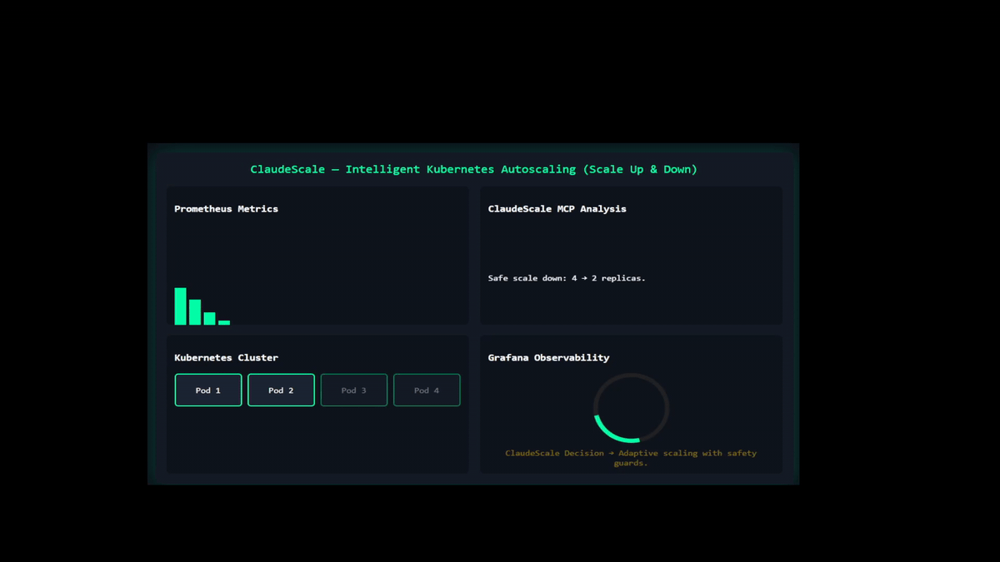

# ClaudeScale

<div align="center">

[](https://kubernetes.io/)
[](https://www.python.org/)
[](https://www.anthropic.com/)
[](https://modelcontextprotocol.io/)

**Intelligent Kubernetes autoscaling that thinks like a human SRE**

<br/>



</div>

ClaudeScale uses Claude AI to make intelligent scaling decisions based on metrics, patterns, and context - not just simple CPU thresholds.

---

## The Problem

Traditional Kubernetes HPA (Horizontal Pod Autoscaler) is reactive and rule-based:
- Only reacts AFTER seeing high CPU/Memory
- No context awareness (time of day, patterns, trends)
- Can't explain decisions
- No proactive scaling

**Result:** Slow reaction times and potential performance degradation during traffic spikes.

---

## The Solution

ClaudeScale adds AI intelligence to Kubernetes autoscaling:
- **Proactive:** Scale BEFORE traffic hits (based on predictions/warnings)
- **Context-aware:** Considers time, patterns, historical data
- **Explainable:** Claude explains WHY it scaled
- **Multi-factor:** Not just CPU - considers memory, network, trends
- **Conversational:** Chat with your infrastructure

---

## Architecture

```
┌─────────────────────────────────────────────────────────┐
│                        User                             │
│                          ↓                              │
│               Claude Desktop (Chat UI)                  │
│                          ↓                              │
│               MCP Server (Python)                       │
│                          ↓                              │
│          ┌───────────────┴───────────────┐              │
│          ↓                               ↓              │
│    Prometheus API                 Kubernetes API        │
│    (Metrics)                      (Scaling)             │
│          ↓                               ↓              │
│   ┌──────────┐                  ┌──────────────┐        │
│   │Prometheus│                  │  Pods (2-5x) │        │
│   │  Pod     │◄──────scrapes────┤              │        │
│   └──────────┘                  └──────────────┘        │
└─────────────────────────────────────────────────────────┘
```

---

## Features

### Core Capabilities
- **AI-Driven Decisions:** Claude analyzes metrics and decides when/how to scale
- **Real-time Monitoring:** Prometheus integration for CPU, Memory, Network
- **Smart Scaling:** Considers multiple factors, not just thresholds
- **Audit Trail:** Every decision is logged and explained
- **Safe Limits:** Min 2, Max 5 replicas with validation

### Intelligence Features
- **Proactive Scaling:** Scale before traffic hits
- **Pattern Recognition:** Learn from historical data
- **Natural Language Control:** "Prepare for high traffic in 10 minutes"
- **Context Awareness:** Time of day, trends, recent events
- **Cost Optimization:** Scale down when not needed

---

## Quick Start

### Prerequisites
- Ubuntu 22.04+ or similar Linux
- Docker installed and running
- 8GB+ RAM
- Claude Desktop app

### Installation
```bash
# 1. Clone repository
git clone https://github.com/kratosvil/ClaudeScale.git
cd ClaudeScale

# 2. Create virtual environment
python3 -m venv venv
source venv/bin/activate
pip install -r requirements-mcp.txt

# 3. Start Minikube
minikube start --driver=docker --memory=4096 --cpus=2

# 4. Deploy Kubernetes resources
kubectl apply -f k8s-manifests/namespace.yaml
kubectl apply -f k8s-manifests/prometheus-configmap.yaml
kubectl apply -f k8s-manifests/prometheus-deployment.yaml
kubectl apply -f k8s-manifests/grafana-configmap.yaml
kubectl apply -f k8s-manifests/grafana-deployment.yaml
kubectl apply -f k8s-manifests/demo-app.yaml
kubectl apply -f k8s-manifests/demo-app-hpa.yaml

# 5. Start port-forwards (each in separate terminal)
kubectl port-forward -n claudescale svc/prometheus 9090:9090
kubectl port-forward -n claudescale svc/grafana 3000:3000
kubectl port-forward -n claudescale svc/demo-app 8080:80

# 6. Open Claude Desktop and chat!
```

---

## Usage Examples

### Check Cluster Status
```
You: Check my Kubernetes cluster status

Claude: Your cluster is healthy with 4 pods running
(demo-app: 2/2, prometheus: 1/1, grafana: 1/1).
```

### Analyze Metrics
```
You: What's the CPU usage?

Claude: Current CPU usage is at 85% utilization
(0.17 cores avg). This is high - I recommend scaling.
```

### Proactive Scaling
```
You: We're expecting 3x traffic in 10 minutes

Claude: I'll scale proactively to 4 replicas now to
prepare for the spike. This gives you 2x capacity
headroom and prevents performance degradation.
```

### Generate Report
```
You: Create a scaling report

Claude: [Generates comprehensive markdown report with
state, metrics, actions, and recommendations]
```

---

## MCP Tools

ClaudeScale provides 4 tools to Claude AI:

| Tool | Purpose | Example |
|------|---------|---------|
| `claudescale_get_current_state` | View deployments & replicas | "Show cluster status" |
| `claudescale_get_metrics` | Query Prometheus for CPU/Memory | "Check CPU usage" |
| `claudescale_scale_deployment` | Scale up/down (2-5 replicas) | "Scale to 4 pods" |
| `claudescale_generate_report` | Create audit report | "Generate report" |

---

## ClaudeScale vs HPA

| Feature | HPA (Native K8s) | ClaudeScale (AI) |
|---------|------------------|------------------|
| **Decision Logic** | Simple threshold (CPU > 50%) | Multi-factor AI reasoning |
| **Timing** | Reactive (after spike) | Proactive (before spike) |
| **Explainability** | None | Full explanation |
| **Context Awareness** | No | Yes (time, patterns, trends) |
| **Prediction** | No | Yes |
| **Custom Metrics** | Limited | Any Prometheus metric |
| **Conversational** | No | Yes (natural language) |

---

## Demo Scenarios

### Scenario 1: Reactive Scaling
1. Generate high CPU load: `bash scripts/stress-until-scale.sh`
2. Ask Claude to check and scale
3. Claude detects 85% CPU → scales 2→3 replicas
4. Explains: "High utilization detected, adding capacity"

### Scenario 2: Proactive Scaling
1. Tell Claude: "Traffic spike expected in 5 minutes"
2. Claude scales 2→4 replicas immediately
3. Traffic arrives, CPU stays at 50% (vs 90% without scaling)

### Scenario 3: Cost Optimization
1. Traffic dies down
2. Ask Claude to optimize
3. Claude scales 4→2 replicas: "Optimizing for cost efficiency"

---

## Project Structure

```
ClaudeScale/
├── mcp-server/                    # MCP Server (Python)
│   ├── server.py                  # Entry point FastMCP
│   ├── config.py                  # Configuration (.env)
│   ├── tools/
│   │   └── scaling_tools.py       # 4 MCP tools
│   └── utils/
│       ├── kubernetes_client.py   # kubectl wrapper
│       └── prometheus_client.py   # Prometheus wrapper
├── k8s-manifests/                 # Kubernetes YAML files
│   ├── namespace.yaml
│   ├── rbac.yaml
│   ├── prometheus-*.yaml
│   ├── grafana-*.yaml
│   └── demo-app*.yaml
├── monitoring/                    # Grafana dashboards & configs
├── scripts/                       # Automation scripts
│   ├── stress-until-scale.sh      # Stress test
│   ├── watch-autoscaling.sh       # Monitor HPA
│   ├── test-mcp-server.sh         # Automated tests
│   └── generate-load.sh           # HTTP load generator
├── docs/                          # Documentation
└── README.md
```

---

## Security

- **RBAC:** ServiceAccount with minimal permissions (list, get, patch deployments)
- **Namespace Isolation:** All resources in dedicated namespace `claudescale`
- **Replica Limits:** Hard min (2) and max (5) to prevent runaway scaling
- **Read-only Metrics:** Prometheus queries are read-only
- **Audit Trail:** All actions logged with reasoning

---

## Testing

```bash
# Automated tests
./scripts/test-mcp-server.sh

# Load test (trigger scaling)
./scripts/stress-until-scale.sh

# Monitor in real-time
./scripts/watch-autoscaling.sh
```

---

## Monitoring

### Grafana Dashboard
```bash
kubectl port-forward -n claudescale svc/grafana 3000:3000
# Open: http://localhost:3000 (admin/admin)
```

### Prometheus
```bash
kubectl port-forward -n claudescale svc/prometheus 9090:9090
# Open: http://localhost:9090
```

---

## License

MIT License - See [LICENSE](LICENSE) file

---

## Author

**kratosvil**
- GitHub: [@kratosvil](https://github.com/kratosvil)
- DevOps Engineer — AWS, Terraform, Kubernetes, AI/DevOps integration

---

## Acknowledgments

- Anthropic for Claude AI and MCP protocol
- Kubernetes and CNCF community
- Prometheus project

---

*Built to demonstrate the future of AI-powered infrastructure automation*
